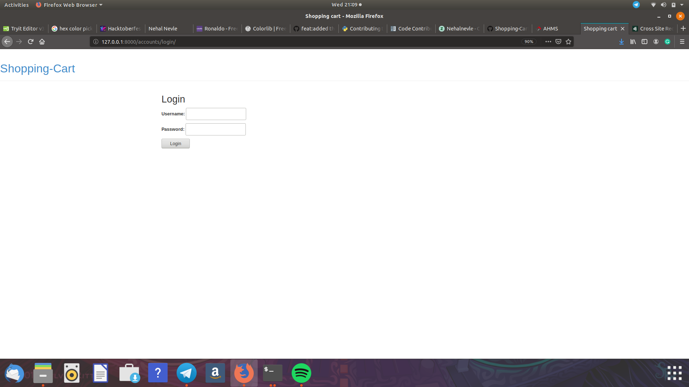
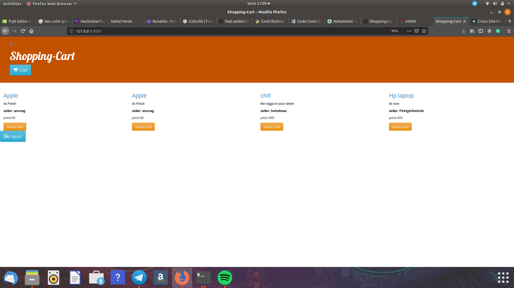
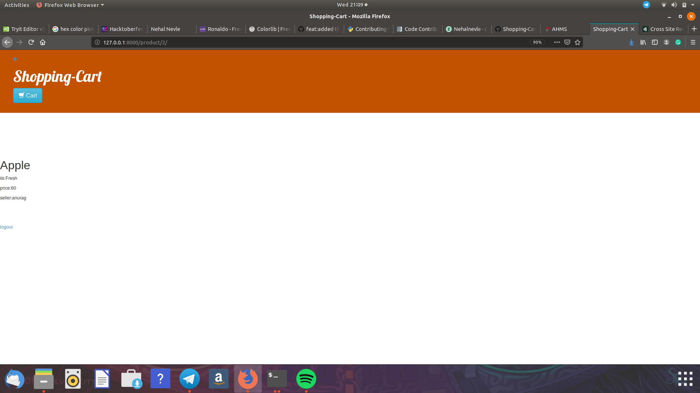
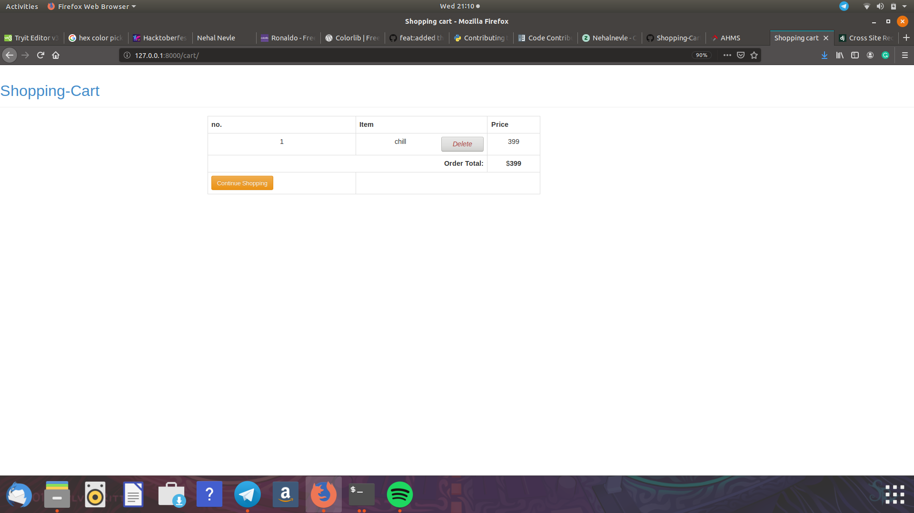
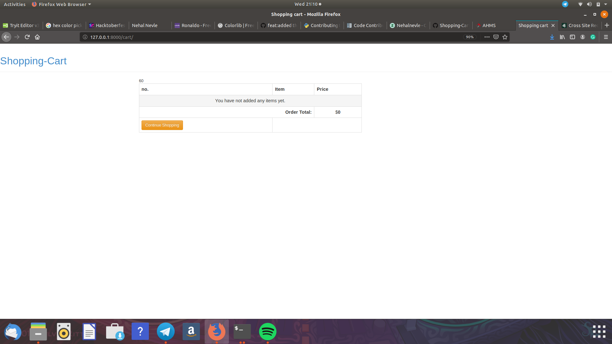
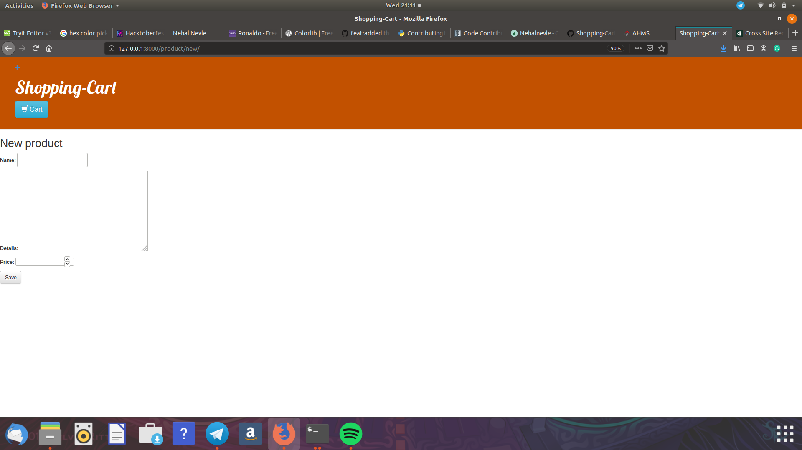
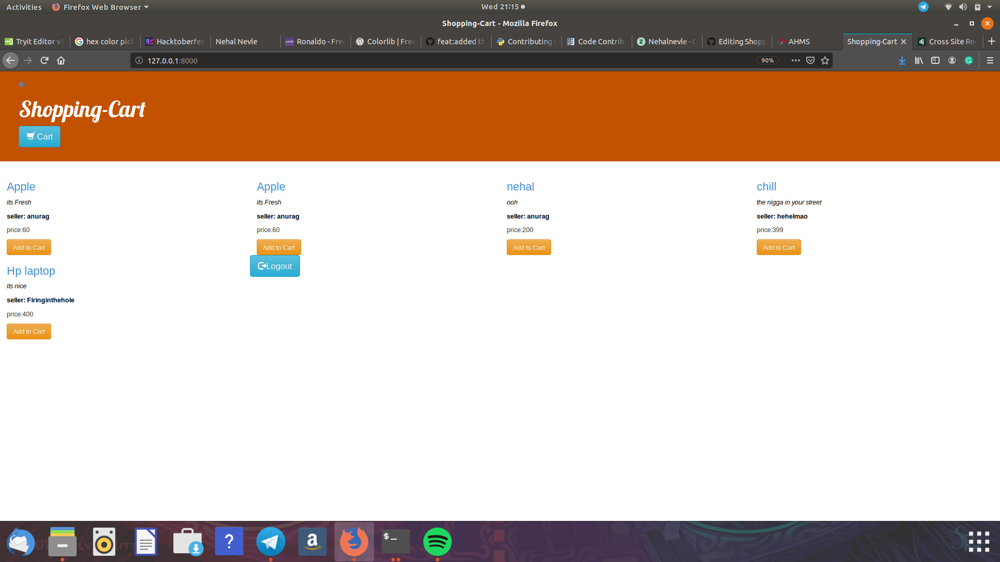

# Project Title

The project is built with the intentions to learn basics of Django.The project is implemted using Django 2.2.4

## Prerequisites

* Git
<br>For Linux
```
sudo apt install git-all
```
<br>For Windows install git Bash

## Installing
### Setting up Django
Run tese commands in terminal/command prompt

Create directory shop

```
mkdir shop
```

move to shop

```
cd shop
```
create virtual env
```
python3 -m venv myvenv
```
activate the eniviroment
```
source myenv/bin/activate
```
Install Django
```
pip3 install Django~=2.2.4
```
### Setting up th project
Clone it
```
git clone https://github.com/yashk2000/Shopping-Cart.git
```
set it up
```
python manage.py makemigrations
python manage.py migrate
python manage.py runserver
```
visit http://127.0.0.1:8000/
## Functinalities
### Login
This uses a buit libarary model <strong>User</strong> to authenticate and authorize the user



### Sign-up

### Product list
Shows the product list

### Product details
Shows the product details if you click heading 

### Add to cart 
Addes the product to cart to calcuate sum 
<br>Before

After

### Delete form cart
deletes unwanted product
<br>Before

After

### Add Product
Addes new product to the inventory
<br>Adding form

New list

