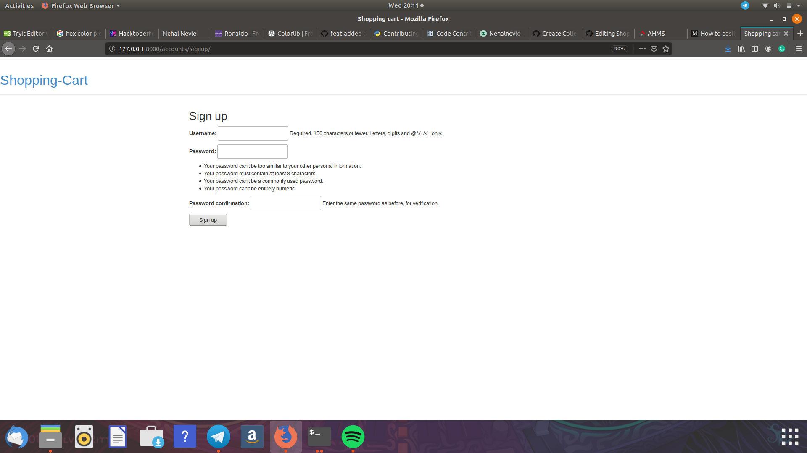

<h1>Shopping cart</h1>

This is created Pyhon's Django Framework

This program will do the following

 <ul style="list-style-type:disc;">
  <li>Signup</li>
 
Sign up uses buitin Userauth libarary in django it takes username and password and send its primary checks it csrf token for security 

 
 
 
 
 
 
 
 
 
 
 
  <li>Login</li>
  
Login uses buitin Userauth libarary in django it takes username and password and send its primary checks it also uses csrf token

  
 
  <li>Display Products</li>
  
I created model known as product with its follwoing attributes the built a specific url and sent requset to view product list
 and renderd it into template

 
   <li>Display Details</li>
 
The link diplays all the details of the product in  separate page 

 
 
   
  <li>Add to a cart</li>
  
created models order and order items when add to cart is pressed it request a view acces the product id and add it to order item then its added to order

  
 
  
  <li>Calculate total</li>
  
the add to cart view returns product price tottal

  <li>Delete item</li>
  
It calls delete view which deletes the order item by using its object id 

  
 
  <li>Add inventory</li>
 
I made a custom form and django form template to add new product

 
 
 
</ul> 
